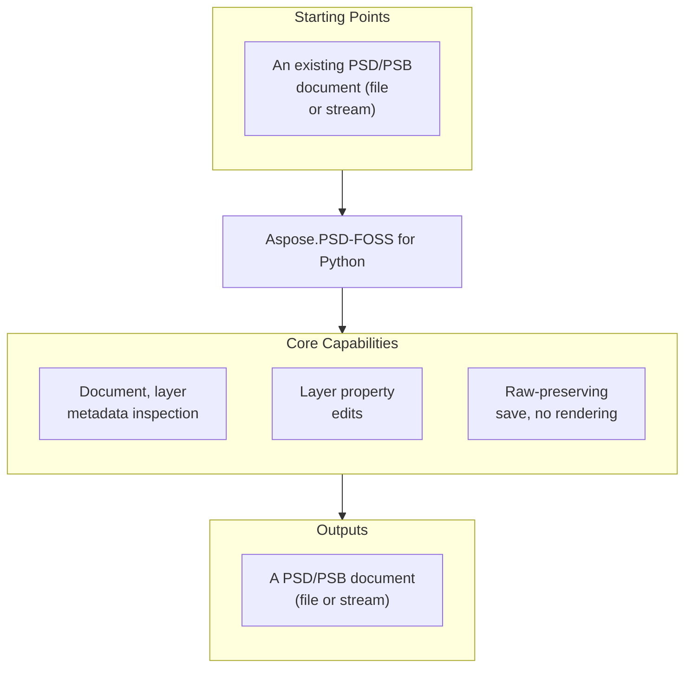

# Aspose.PSD-FOSS for Python

 [](https://github.com/aspose-psd-foss/Aspose.PSD-FOSS-for-Python/graphs/contributors)

[](https://products.aspose.org/psd/python/)

Aspose.PSD-FOSS is a free, open-source Python library for loading, inspecting, and making a
limited set of layer-metadata edits to PSD/PSB files, then saving the result back without
rendering. It is for PSD/PSB inspection and small, targeted layer-property edits — not a
rendering engine, a raster editor, or an open-source replacement for the full commercial
Aspose.PSD product.

## Navigation

- [At a Glance](#at-a-glance)
- [Key Capabilities](#key-capabilities)
- [Installation](#installation)
- [Dependencies](#dependencies)
- [Quick Start](#quick-start)
- [Additional Examples](#additional-examples)
- [API Reference](#api-reference)
- [Documentation & Resources](#documentation--resources)
- [Scope and Limitations](#scope-and-limitations)
- [Development and Testing](#development-and-testing)
- [License](#license)

## At a Glance



## Key Capabilities

- Loads and inspects a PSD document, or the currently supported subset of the PSB large-document
  format, from Python code in the Aspose.PSD-compatible style —
  `PsdImage.load(path_or_stream)`, usable as a context manager (`with PsdImage.load(...) as
  image:`) — and reads real document properties from the parsed header: `width`, `height`,
  `channels_count`, `bits_per_channel`, and `color_mode`. `compression` comes from the merged
  image data section, and `version` is a fixed Aspose.PSD-compatible marker (see
  [Scope and Limitations](#scope-and-limitations)). `is_psb`/`is_large_document` report which
  container was loaded.
- Reads supported high-level metadata from the PSD/PSB document's own structural sections: the
  header (`color_mode`), Color Mode Data (`has_color_mode_data`, `color_data_info`,
  `indexed_palette`), Image Resources (`image_resources`, `resource_count`), Layer and Mask
  Information (`layers`, `layer_count`, `has_layers`), and the merged image data
  (`compression`, `image_data_info`, `image_data_kind`, `uses_prediction`) — through a compact
  public API rather than the whole Photoshop document model.
- Enumerates parsed layers through `image.layers`, reading each layer's `name`, local `bounds`,
  `width`/`height`, `top`/`left`/`bottom`/`right` document-coordinate edges, `is_visible`,
  `opacity`, `clipping`, and `blend_mode_key` — all 28 real PSD blend modes, from `BlendMode.NORMAL`
  and `BlendMode.MULTIPLY` through `BlendMode.DISSOLVE` and `BlendMode.PASSTHROUGH`.
- Changes a deliberately narrow set of layer properties — `name`, `is_visible`, `opacity`,
  `clipping`, `blend_mode_key`, and the layer-record rectangle through `top`/`left`/`bottom`/
  `right` — and saves the result back with `image.save(path)` without ever rendering a pixel.
  Geometry edits rewrite only the layer record's rectangle; the layer's channel pixel data is
  written back unchanged. `opacity` and `clipping` are not range-checked (an `opacity` above
  255 wraps when saved), and layer names are ASCII-only (see
  [Scope and Limitations](#scope-and-limitations)).
- Saves with a minimal parse-and-raw-preserve strategy: supported structures are parsed and
  rewritten only when something actually changed, and unsupported sections round-trip as raw
  bytes. A save with no mutations reproduces the original file byte-for-byte.
- Restores a seekable input stream's original position after loading, so the library can be used
  inside a larger workflow that shares one stream across several readers.

## Installation

Install from a clone of the repository by adding the checkout to your Python path:

```bash
git clone https://github.com/aspose-psd-foss/Aspose.PSD-FOSS-for-Python.git
cd Aspose.PSD-FOSS-for-Python
python -c "from aspose_psd_foss.psdimage import PsdImage; print(PsdImage)"
```

That last line is a smoke test — if it prints the class instead of raising
`ModuleNotFoundError`, the library is importable. In your own project, either run from inside
this checkout or add it to `sys.path`/`PYTHONPATH`:

```python
import sys
sys.path.insert(0, "/path/to/Aspose.PSD-FOSS-for-Python")

from aspose_psd_foss.psdimage import PsdImage
```

The library targets Python 3.9 or later — see [Dependencies](#dependencies) below for the full
required, native, and development-only breakdown.

## Dependencies

### Required Package Dependencies

No required third-party package dependencies. Every `import`/`from` statement in
`aspose_psd_foss/` resolves to either the Python standard library (`typing`, `enum`, `io`,
`hashlib`, `math`, `struct`, `sys`, `abc`, `os`, `copy`) or another `aspose_psd_foss` module —
PSD/PSB parsing and writing are implemented natively within the library.

### Native and System Requirements

- Python 3.9 or later. The library uses built-in generic annotations such as `list[Layer]` in
  places Python evaluates when the module loads (for example the layer-section reader's return
  type), which raise `TypeError` on Python 3.8 and earlier. The import smoke test in
  [Installation](#installation) does not reach that module — a Python older than 3.9 can pass
  it and still fail on `PsdImage.load`.

### Development Dependencies

- `pytest` — the test runner used by the test modules under `aspose_psd_foss_test/`. No
  version is pinned anywhere in the repository.

None of these are imported by the main library package; `pytest` is used only by
`aspose_psd_foss_test/`.

## Quick Start

```python
from aspose_psd_foss.psdimage import PsdImage
from aspose_psd_foss.layers.blendmode import BlendMode

image = PsdImage.load("input.psd")

print(image.width)
print(image.height)
print(image.channels_count)
print(image.bits_per_channel)
print(image.color_mode)
print(image.version)
print(image.compression)
print(len(image.layers))
print(len(image.image_resources))

for layer in image.layers:
    print(layer.name)
    print(layer.bounds)
    print(layer.blend_mode_key)
    print(layer.is_visible)
    print(layer.opacity)

layer = image.layers[0]
layer.name = "Updated layer"
layer.is_visible = False
layer.left = 10
layer.top = 20
layer.right = 110
layer.bottom = 120
layer.opacity = 128
layer.blend_mode_key = BlendMode.MULTIPLY
image.save("output.psd")
```

The examples assume the document has at least one layer — `image.layers` is empty for a
flattened PSD (`image.is_flatten`), and indexing `image.layers[0]` would raise `IndexError`.

## Additional Examples

<details>
<summary>View Additional Examples</summary>

### Change Several Layer Properties at Once Before Saving

```python
from aspose_psd_foss.psdimage import PsdImage
from aspose_psd_foss.layers.blendmode import BlendMode

image = PsdImage.load("input.psd")
layer = image.layers[0]
layer.name = "Updated layer"
layer.is_visible = False
layer.opacity = 128
layer.blend_mode_key = BlendMode.MULTIPLY
layer.clipping = 1
layer.left += 1
layer.top += 1
layer.bottom += 1
image.save("output.psd")
```

### Load From an In-Memory Stream

`PsdImage.load` accepts a readable stream as well as a file path, and restores the stream's
original position after loading:

```python
import io

from aspose_psd_foss.psdimage import PsdImage

with open("input.psd", "rb") as f:
    data = f.read()

stream = io.BytesIO(data)
image = PsdImage.load(stream)
print(image.width, image.height)
```

</details>

## API Reference

`PsdImage` (the only concrete `Image` subclass) is the library's central entry point; `Layer`
carries the editable per-layer metadata it exposes through `image.layers`, including the
official-style resource, channel, mask, and blending-range surfaces below. The public surface
spans 64 classes and enumerations across 8 modules, summarized below.

<details>
<summary>View the Full API Surface</summary>

### Core API

| Class | Description |
|---|---|
| `BigEndianReader` | Reads big-endian data from a stream. |
| `BigEndianWriter` | BigEndianWriter.position property returns the current write offset in the underlying stream. |
| `Image` | Abstract base class for image objects. |
| `ImageLoader` | Provides the load functionality for images. |
| `LayerAndMaskSectionReader` | Class with 1 method. |
| `LayerAndMaskSectionWriter` | Writes PSD/PSB Layer and Mask Information sections. |
| `Point` | The Point class provides empty() to obtain a zero point and equals(other) to compare coordinates; its properties include x, y, is_empty, and the static Empty. |
| `PsdImage` | Represents a PSD image that can be loaded, inspected, and saved without rendering. |
| `PsdSectionReader` | Provides bounded reads for PSD/PSB sections that are stored in memory by this implementation. |
| `Rectangle` | Stores a set of four integers that represent the location and size of a rectangle. |
| `RectangleF` | Stores a set of four floating-point numbers that represent the location and size of a rectangle. |
| `ResourceBlock` | Represents a PSD image resource block. |
| `Size` | Class with 3 methods and 5 properties. |
| `StreamContainer` | Represents a stream container used by resource save APIs. |
| `ColorModes` | Defines the color modes supported by PSD files. |
| `CompressionMethod` | Defines the compression methods used for image data in PSD files. |
| `PsdVersion` | Enum with 2 members. |
| `ResourceBlockState` | Represents resource block state. |
| `SeekOrigin` | Defines seek origin for reader. |

### Conversion

| Class | Description |
|---|---|
| `BigEndianBitConverter` | Provides helper methods for reading big-endian primitive values from byte arrays. |

### Coreexceptions

| Class | Description |
|---|---|
| `ArgumentNullException` | Exception that is thrown when argument is null. |
| `NotSupportedException` | Exception that is thrown when operation is not supported. |
| `PsdLoadException` | Exception that is thrown when an error occurs while loading a PSD file. |
| `PsdSaveException` | Initializes a new instance of the PsdSaveException class. |

### Layers

| Class | Description |
|---|---|
| `BlendRange` | Represents a PSD layer blend range. |
| `ChannelInformation` | Represents PSD layer channel information. |
| `GlobalLayerMaskInfo` | Class with 1 method. |
| `Layer` | Layer channel IDs and data lengths are available via the PsdLayerChannelInfo properties channel_id and data_length. |
| `LayerBlendModeMapper` | Class with 2 methods and 1 member. |
| `LayerBlendingRangesData` | Represents PSD layer blending ranges data. |
| `LayerBlendingRangesInfo` | Class with 1 method and 2 properties. |
| `LayerChannelInfo` | Stores one channel metadata entry from a layer record. |
| `LayerMaskData` | Defines the base class for PSD layer mask data. |
| `LayerMaskDataShort` | Defines layer mask data for layers that have only a raster or vector mask. |
| `LayerMaskInfo` | Class with 1 method and 2 properties. |
| `LayerRawData` | Class with 4 methods and 7 properties. |
| `LayerRecordReader` | Class with 1 method and 3 members. |
| `LayerRecordWriter` | Writes PSD/PSB layer records from the in-memory Layer model. |
| `LayerResource` | Class with 1 method and 4 properties and 2 members. |
| `PsdLayerChannelInfo` | Provides a read-only summary of one parsed layer channel record. |
| `RawLayerBlendingRangesSection` | Class with 3 methods and 1 property. |
| `RawLayerMaskSection` | Class with 3 methods and 1 property. |
| `BlendMode` | Defines the blend modes used for layers in PSD files. |
| `LayerMaskFlags` | Defines PSD layer mask flags. |

### Loaders

| Class | Description |
|---|---|
| `PsdImageLoader` | Class with 1 method. |

### Resources

| Class | Description |
|---|---|
| `ImageResourceIds` | Provides common PSD image resource identifiers used by tests and fixtures. |
| `IndexedColorPalette` | Class with 3 methods and 1 property and 1 member. |
| `IndexedColorPaletteInfo` | Provides a read-only view over an indexed-color PSD palette. |
| `PreservedResourceBlock` | Adapts a raw‑preserved image resource to the official ResourceBlock surface. |
| `PsdResourceInfo` | Provides a read-only summary of one parsed PSD image resource block. |
| `UnknownResource` | Initializes a new instance of the UnknownResource class. |
| `PsdResourceKind` | Enum with 4 members. |

### Sections

| Class | Description |
|---|---|
| `ColorData` | Stores the PSD Color Mode Data section as raw bytes plus mode‑aware parsed structure when available. |
| `ImageData` | Stores the PSD Image Data section as a compression header plus raw payload bytes. |
| `ImageDataStructure` | Describes the validated structural layout of the PSD Image Data payload. |
| `ImageResourcesSection` | Represents the PSD Image Resources section as raw‑preserved bytes plus unknown‑only parsed summaries. |
| `LayerAndMaskSection` | Represents the PSD/PSB Layer and Mask Information section and its raw-preserved save state. |
| `PsdColorDataInfo` | Provides a read-only summary of the PSD Color Mode Data section. |
| `PsdHeader` | Contains the header information of a Photoshop document. |
| `PsdImageDataInfo` | Class with 1 method and 5 properties. |
| `PsdImageDocumentState` | Stores parsed PSD/PSB document sections used by PsdImage. |
| `ImageDataKind` | Identifies the structural shape of the PSD Image Data payload. |
| `PsdColorDataKind` | Describes how the Color Mode Data payload was interpreted for the loaded document. |

### Writedescriptors

| Class | Description |
|---|---|
| `PsdImageWriter` | Writes parsed PSD/PSB document state to a stream. |

#### Detailed Member Reference

- `Image` — abstract base type: its only member is the static `load(source)` factory;
  `width` and `height` are defined on `PsdImage`.
- `PsdImage` — the concrete `Image`: static `load(path_or_stream)`, `save(path_or_stream)`,
  `dispose()` (and `with` support), `width`, `height`, `bits_per_channel`, `color_mode` (a plain
  `int` at runtime, not a `ColorModes` member; its public setter rewrites the header's color
  mode without converting any pixel data), `version` (always `6`; the setter accepts only `6`),
  `is_psb`, `is_large_document`, `layers` (its public setter replaces the whole layer list and
  forces the layer section to be rewritten), `layer_count`, `has_layers`, `channels_count`,
  `size`, `active_layer` (always the first layer), `image_resources`, `resource_count`,
  `has_color_mode_data`, `color_data_info`, `indexed_palette`, `has_merged_image_data`,
  `image_data_info`, `image_data_kind`, `uses_prediction`, `global_layer_resources`,
  `global_layer_mask_info`, `is_flatten` (true when the document has no layers),
  `has_transparency_data`, `compression`, `global_angle`.
- `Layer` — `name`, `bounds` (read-only local rectangle), `width`, `height`,
  `top`/`left`/`bottom`/`right` (mutable document-coordinate edges), `is_visible`, `opacity`,
  `clipping`, `blend_mode_key`, `channels_count`, `channel_information`, `layer_mask_data`,
  `layer_blending_ranges_data`, `mask_info`, `blending_ranges_info` (presence and raw byte
  length only), `additional_layer_data` (raw bytes), and the `LAYER_TRAILER_SIZE` constant.
- `ChannelInformation` — `ChannelID` (PascalCase), `compression_method` (parsed channels always
  report `RAW`, whatever the file's real channel compression), `length`; read-only —
  `Layer.channel_information`'s setter raises `NotSupportedException`.
- `LayerMaskData` (abstract) / `LayerMaskDataShort` — `bottom`/`left`/`right`/`top`,
  `mask_rectangle`, `data_size`, `default_color`, `flags`, `image_data`.
- `LayerBlendingRangesData` / `BlendRange` — `composite_blend_range`, `channel_blend_ranges`,
  `length`.
- `GlobalLayerMaskInfo` — a marker type with no exposed members; see
  [Scope and Limitations](#scope-and-limitations).
- `ResourceBlock` (abstract) — `id`, `name`, `signature`, `size`, `data_size`,
  `minimal_version`, `save(stream)` (raises `NotImplementedError` for every block this library
  returns), `validate_values()`.
- `LayerResource` (abstract) — layer-resource base type (key/length/signature/save).
- `ColorModes` — `BITMAP`, `GRAYSCALE`, `INDEXED`, `RGB`, `CMYK`, `MULTICHANNEL`, `DUOTONE`,
  `LAB`.
- `CompressionMethod` — `RAW`, `RLE`, `ZIP_WITHOUT_PREDICTION`, `ZIP_WITH_PREDICTION`.
- `BlendMode` — 28 members matching the real PSD blend-mode keys, from `NORMAL` through
  `PASSTHROUGH`, plus `ABSENT`.
- `PsdVersion` — `Psd`, `Psb` (an `IntEnum`, importable from `aspose_psd_foss.psdversion`).
- `Rectangle` / `RectangleF` / `Point` / `Size` — Aspose.PSD-compatible geometry value types.
- `PsdLoadException` / `PsdSaveException` — raised on a load or save failure respectively
  (`PsdSaveException` is raised when a layer name exceeds 255 bytes); loading a path that does
  not exist raises `FileNotFoundError`.

</details>

## Documentation & Resources

- **[Documentation site](https://docs.aspose.org/psd/python/)** — installation, walkthroughs,
  and feature guides for this library.
- **[How-to guides & FAQ](https://kb.aspose.org/psd/python/)** — task-focused answers for
  common PSD/PSB inspection and layer-editing questions.
- **[Full API reference](https://reference.aspose.org/psd/python/)** — the complete, browsable
  reference for all 64 documented types (the [API reference](#api-reference) section above
  covers the essentials).
- Found a bug or have a feature request?
  [Open an issue](https://github.com/aspose-psd-foss/Aspose.PSD-FOSS-for-Python/issues) on
  GitHub.

## Scope and Limitations

- **Structural inspection and limited editing only — not a rendering engine.** The library
  parses only a small supported subset of the full PSD/PSB format and never decodes or renders
  pixels; there is no raster export, no pixel editing, and no export to PNG, JPEG, or other
  raster images anywhere in the library.
- **Several Aspose.PSD-compatible members are present for API shape only and always return a
  fixed, disconnected value.** `global_layer_resources` always returns an empty list and its
  setter raises `NotSupportedException`; `global_layer_mask_info` always returns an empty marker
  object with no members; `has_transparency_data` always returns `False`; `image_resources`
  reads real preserved resource blocks but its setter raises `NotSupportedException`;
  `active_layer`'s setter raises `NotSupportedException`. `global_angle` is a plain stored value
  with no connection to the parsed document at all — setting it has no effect on what gets
  saved.
- **`layer_mask_data` reports presence only; `layer_blending_ranges_data` reports presence and
  byte length — neither reports parsed content.** A layer's `layer_mask_data` is non-`None` only
  when the layer genuinely has a mask subsection, but the returned object is a fresh default
  each time (`default_color`, `flags`, `image_data`, `mask_rectangle` and the edges are always
  their type's default, never the mask's real parsed bytes); its setter raises. A layer's
  `layer_blending_ranges_data.length` is the raw subsection length minus its 4-byte length
  prefix, but `composite_blend_range`/`channel_blend_ranges` are always empty defaults, not
  parsed ranges. `mask_info` and `blending_ranges_info` likewise carry only presence and raw
  length.
- **Image resources are read as opaque, unknown-only blocks.** `image_resources` exposes each
  resource's `id`, `name`, and `data_size`, but does not interpret any specific resource ID's
  real structure (no ICC-profile, slice, or guide semantics, for example) — only generic,
  byte-preserving read access.
- **`version` is a fixed Aspose.PSD-compatibility marker, not the file's own version field.**
  It always reads `6`; setting it to anything other than `6` raises `ValueError`. To tell which
  real container was loaded, use `image.is_psb` (equivalently `image.is_large_document`).
- **Layer edits change layer-record metadata only.** Setting `top`/`left`/`bottom`/`right`
  rewrites the layer record's rectangle but leaves the layer's channel data lengths and pixel
  bytes exactly as they were, so a resized rectangle no longer matches its pixel data.
  `opacity` and `clipping` are not validated — an `opacity` of `300` is saved and reloads as
  `44`. Layer names are written as ASCII Pascal strings: a non-ASCII name makes `save` raise
  `UnicodeEncodeError`, a name longer than 255 bytes raises `PsdSaveException`, and the layer's
  additional layer data is written back verbatim, so any Unicode layer-name block already in the
  file keeps its old value after a rename.
- **Parsed channel information is read-only and always reports `CompressionMethod.RAW`.**
  `Layer.channel_information`'s setter raises `NotSupportedException`.
- **Load enforces PSD/PSB header limits.** Channel count must be 1–56, bit depth one of 1, 8,
  16, or 32, and width and height at most 30000 pixels (PSD) or 300000 pixels (PSB); anything
  else raises `PsdLoadException`. A missing path raises `FileNotFoundError`.
- **`ResourceBlock.save` is not supported** — it raises `NotImplementedError` for every block
  `image_resources` returns. `active_layer` always returns the first layer.
- **No full Photoshop feature set.** No text, vector, effects, smart filters, or adjustment-layer
  rendering; no semantic recognition of specific image-resource kinds; no full tagged-block
  editing.

These limitations apply only to Aspose.PSD-FOSS — they don't carry over to
[Aspose.PSD for Python — Enterprise Edition](https://products.aspose.com/psd/python-net/), which adds full Photoshop
rendering, raster editing, export pipelines, richer resource and tagged-block handling, and
much wider PSD/PSB compatibility.

## Development and Testing

Run the test suite from the repository root:

```bash
python -m pytest -o "python_files=*tests.py" aspose_psd_foss_test
```

The `-o "python_files=*tests.py"` override is required: every test module's filename ends in
`tests.py` (for example `psdimagesavetests.py`), which doesn't match pytest's own default
`test_*.py`/`*_test.py` discovery pattern, and no `pytest.ini`/`conftest.py` configures it. The
test suite has no packaged dependency beyond `pytest` itself and runs directly against the
checked-out source — no build or install step is required first. The tests write an
`artifacts/` directory into the current working directory.

## License

This project is licensed under the MIT License. The MIT License permits use, copying,
modification, distribution, sublicensing, and commercial use, provided its copyright and
permission notice are retained. The software is provided without warranty.
